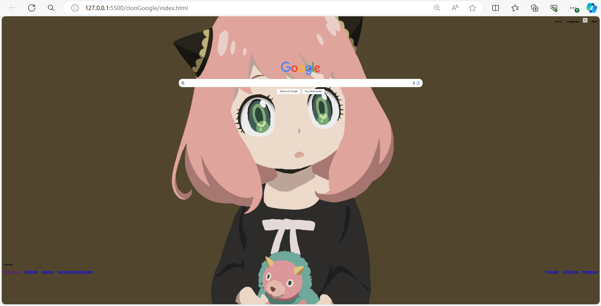

# proyecto Clon de Google de Tecnolochicas PRO

Esta actividad implica recrear la interfaz de la plataforma Google durante la clase  TECNOLOCHICAS PRO.

[proyecto en linea ](https://clongoog.netlify.app/)

- Tecnologías
 
* HTML
* CSS

- Capturas de pantalla 

- Créditos
Creado por Itzel Nicolás en el bootcamp de Technolochicas PRO.
